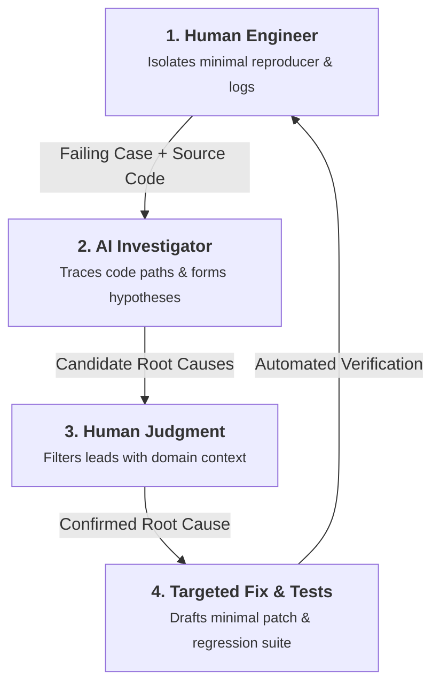

Much of the public conversation around AI coding tools focuses on raw speed: how many lines of code an agent can write per minute, or how quickly it can build a demo app from a prompt. In production R&D, this metric misses the point entirely.

Writing new code is rarely what slows engineering teams down. As we explored when discussing [exploratory versus structural debt](/2026/08/15/managing-exploratory-debt-vs-structural-debt.html) and [slashing technical debt with AI agents](/2026/08/22/ai-agents-reducing-technical-debt-in-rd.html), generating unconstrained code without architectural discipline simply accelerates compounding complexity. The real bottleneck in production engineering is **comprehension and debugging**: reading, tracing, and understanding established codebases where subtle interactions between hardware drivers, memory buffers, and asynchronous tasks lead to rare, baffling bugs.

A great real-world example recently came from the Linux kernel, where Linus Torvalds documented what he described as a *"debug session from hell"* in [commit `818bebeb63dd`](https://git.kernel.org/pub/scm/linux/kernel/git/torvalds/linux.git/commit/?id=818bebeb63dd) (*"drm/xe: Don't hand out the flat CCS storage as usable VRAM"*). A two-year-old memory alignment bug in the Intel GPU driver was causing display managers to crash on discrete cards. Tracking it down required 24 diagnostic patches and 18 kernel boots. As Torvalds detailed, an AI tool proved valuable for the mechanical grunt work: parsing verbose logs, checking code paths, and proposing test hooks. The human engineer provided domain judgment, persistence, and the physical reproduction harness; the AI acted as an exhaustive assistant digging through the code.

This dynamic illustrates the real value of AI in production engineering: not an autocomplete engine, but a **systematic code investigator**.

---

## 1. Why Reading Code Is So Much Harder Than Writing It

> **The Reality:** Writing code is generative; reading it is forensic. Holding multi-threaded state, memory lifecycles, and hardware constraints in working memory is where human cognitive limits are reached.

When tracking an elusive bug—an intermittent race condition, a GPU sync stall, or a subtle coordinate drift in a 3D pipeline—an engineer must hold a massive mental model at once:

1. The underlying mathematical and algorithmic rules.
2. The hardware execution model (cache layout, SIMD alignment, GPU queues).
3. Thousands of lines of existing code written by different team members over several years.

Human attention degrades rapidly under this load. After hours of tracing nested function pointers across C++ headers and driver wrappers, focus wanes. We miss subtle state mismatches, overlook undocumented parameter quirks, and fall into confirmation bias.

An AI agent, by contrast, operates with consistent analytical bandwidth. When given clear boundaries, it can ingest tens of thousands of lines of source code, parse interfaces, cross-reference log files, and trace state changes across twenty files in seconds without losing track of details.

* **✕ The Naive Trap (Manual Grunt Work):** Senior engineers spend days manually using `grep` and setting speculative breakpoints across legacy subsystems, burning their best energy on mechanical code searches.
* **✓ The Industrial Pattern (Guided Agentic Search):** The engineer defines the expected behavior and reproduction logs, letting the agent systematically trace the call graph and surface candidate root causes for review.

---

## 2. The Forensic Investigation Loop

To use an AI agent effectively for debugging without getting sidetracked by hallucinations, you need a structured workflow. Pasting a raw error message into a chat prompt and asking "how do I fix this?" usually produces fragile, shallow guesses.

Instead, engineering teams should follow a structured **Forensic Investigation Loop**:

### Step 1: Human Builds a Minimal Reproducer and Captures Logs
The human engineer starts by isolating the problem into a minimal reproducible test case. This means capturing deterministic logs, memory snapshots, or a standalone script that triggers the issue. The quality of the agent's investigation depends directly on how cleanly this reproduction harness is defined.

### Step 2: Agent Traces Execution Paths and Generates Hypotheses
Feed the agent the reproducer, the relevant source files, and the expected system rules. Ask the agent to audit the flow: *"Here is the execution log where variable X goes out of sync with buffer Y. Traverse the attached files and find all execution paths that modify state X without updating buffer Y."* The agent generates a ranked list of candidate root causes based on strict code inspection.

### Step 3: Human Applies Domain Judgment to Filter Candidates
The engineer reviews the hypotheses. Because humans understand the broader physical and system context (such as known hardware quirks or timing constraints), the engineer can quickly dismiss false leads and pick the true root mechanism.

### Step 4: Agent Implements the Minimal Fix and Regression Test
Once the root cause is confirmed, the agent writes a clean, minimal fix. Crucially, the agent also writes an automated regression test that explicitly validates the repaired rule under stress, ensuring the bug cannot quietly return in future releases.

---

## 3. Fixing Root Causes Instead of Masking Symptoms

A common trap when using AI agents for debugging is what we might call the **band-aid reflex**. When presented with a crash, null dereference, or out-of-bounds index, a naive agent will instinctively suggest wrapping the failing line in an `if (ptr != nullptr)` guard or a generic `try/catch` block.

Defensive checks and exception handling are vital at system boundaries (such as parsing user input, file I/O, or network payloads). However, using them internally to silence a crash simply **masks the symptom while allowing invalid state to travel further down the pipeline**. In scientific computing, graphics, and robotics, swallowing an internal contract violation turns an immediate, debuggable crash into silent numerical drift or corrupted geometry millions of cycles later.

> **The Core Rule:** Do not let the agent silence the failure at the point of impact. Require the agent to trace back to where the invariant was first violated, and fix the contract at its origin.

When guiding an agent through an investigation, enforce clear expectations between boundary validation and internal contract fixes:

* **✕ The Naive Trap (Symptom Masking):** Adding local null-checks, exception swallowers, or arbitrary sleep delays that merely suppress crashes while letting corrupted state propagate.
* **✓ The Industrial Pattern (Root-Cause Resolution):** Distinguishing boundary validation from internal logic errors, forcing the agent to explain why the internal contract failed and repairing the state machine upstream.

By asking architectural questions (such as *"Why was this buffer freed before the render task completed?"* rather than *"How do I stop this line from crashing?"*), you guide the agent toward genuine structural fixes rather than superficial suppression.

---

## 4. The Right Division of Labor: Human Judgment, Machine Scale

The relationship between engineers and AI tools in deep technical work is about **complementary strengths**, not replacement. Each side brings unique advantages to the table:

| Dimension | The Human Engineer | The AI Agent |
| :--- | :--- | :--- |
| **Main Strength** | System judgment, physical intuition, architectural taste | Fast search, cross-file tracking, unfaltering consistency |
| **Primary Role** | Defining test cases, setting system rules, validating fixes | Reading codebase, auditing execution paths, drafting patches |
| **Risk** | Cognitive overload, confirmation bias over large codebases | Hallucinating assumptions when given loose constraints |
| **Value Delivered** | Ensures the software solves the right real-world problem | Cuts investigation time from days of frustration to hours |

When this division of labor is in place, the team dynamic shifts. Senior engineers spend far less time on mechanical code searches and can focus on what matters most: designing clean architectures, refining mathematical models, and delivering robust products.

> **💡 Practical / Single-Machine Setup:**
> You do not need massive cloud infrastructure to use this workflow. A local agent in your terminal or editor, configured with read access to your repository, compiler output, and test runner, provides this exact investigative capability directly on your development workstation.

---

## 5. Conclusion: Amplifying Human Depth

The tech industry loves demos that generate entire applications from a single prompt. But for teams building native engines, geometric processing pipelines, and industrial software, writing more code is rarely the goal. Often, the highest-value engineering is deleting dead code, simplifying bloated layers, and stabilizing core foundations.

What made the Linux kernel investigation successful was not an AI acting autonomously, but the **relentless determination and prior domain knowledge of the engineer steering it**. An AI model possesses neither physical intuition nor the grit to persevere through dozens of failed reproduction attempts, cryptic crash dumps, and elusive hardware states. Without experienced engineers who understand how the system ought to behave to point the investigative flashlight, an agent will simply wander through plausible hallucinations, running in circles until giving up after a few repetitive, failed trial-and-error attempts.

AI tools deliver their highest value when deep human expertise directs automated search. They do not replace the engineer's judgment; they amplify it, transforming grueling forensic hunts into structured, manageable breakthroughs.

As you integrate AI tools into your engineering workflows, keep this principle in mind:

> *Great software is built on human rigor, intuition, and determination. AI simply gives that human depth the tireless leverage to explore further, debug deeper, and build foundations that last.*
