Every seasoned software engineer carries a private catalog of scars. We remember the obscure memory corruption that ruined a weekend, the subtle off-by-one error inside an image convolution kernel, the multithreaded race condition that only reproduced under production load, and the hours spent parsing unreadable C++ template compiler errors. 

Historically, this painful friction was the engine of technical apprenticeship. Junior engineers did not start by architecting distributed systems or designing core mathematical abstractions. They began in the trenches: fixing low-severity bugs, writing mundane test scaffolding, plumbing serialization boilerplate, and porting glue logic between modules. It was slow, frustrating, and undeniably inefficient. Yet through those hundreds of hours of mechanical wrestling, something vital was forged: an internal mental compiler. You learned how hardware actually behaves, how abstractions leak, and why simple code is a superpower.

Today, that entire foundation is being upended. Autonomous coding agents, driven by frontier reasoning models, now handle that entry-level toil in seconds. They generate boilerplate, scaffold unit tests, draft foreign function interface (FFI) wrappers, and resolve isolated bug tickets with astonishing speed. As we observed when examining how [agents slash technical debt](/2026/08/22/ai-agents-reducing-technical-debt-in-rd.html) and [reclaim cognitive space to think](/2026/09/05/the-cadence-of-thought-reclaiming-the-time-to-reflect.html), the mechanical tax of software development is collapsing.

This collapse brings a profound, unanswered question to engineering leadership: **If autonomous agents eliminate the entry-level friction that forged our current senior engineers, how will tomorrow's senior engineers ever develop taste, intuition, and judgment?**

If we do not deliberately re-architect technical apprenticeship, the industry risks creating a generation of hollow architects: engineers who can prompt complex systems into existence overnight, but lack the diagnostic depth to fix them when they inevitably shatter.

---

## 1. The Illusion of Fluency and the Generational Cliff

> **The Operational Risk:** Optimizing for immediate quarterly velocity by freezing junior pipelines trades short-term efficiency for long-term organizational blindness.

In the face of powerful autonomous agents, a dangerous consensus is quietly forming in boardrooms and engineering organizations: *Why hire junior engineers when a single senior developer, armed with an agentic IDE and autonomous background workers, can match the output of an entire four-person team?*

In the short term, the financial arithmetic looks compelling. Senior engineers know what to ask for, how to catch edge cases, and how to direct agents effectively. The friction of mentoring, code reviews for beginner mistakes, and onboarding delays appears to vanish.

Yet this logic borrows against the future at a predatory interest rate. Engineering talent is not an extracted commodity; it is cultivated through continuous apprenticeships. If an industry stops hiring and nurturing early-career engineers today, where will the principal architects, team leads, and system designers come from in seven to ten years? The outcome is an inevitable generational cliff: an aging cohort of veterans retiring without successors capable of carrying deep industrial systems forward.

Even for companies that continue hiring junior talent, an equally subtle failure mode emerges: **the illusion of fluency**.

When an early-career engineer uses an autonomous agent to build a feature, the experience feels intoxicating. They type a natural-language intent, and within seconds, a polished, fifty-line function with type annotations and unit tests appears. The code compiles. The tests pass. The feature merges.

```
Prompt -> Generated Code -> Passing Tests -> Merged PR
```

Superficially, the engineer delivered value. But internally, no mental model was constructed. The developer skipped the ten failed attempts, the inspection of stack traces, the memory profiler graphs, and the visceral confrontation with hardware constraints. 

Reading clean generated diffs is fundamentally different from understanding how a system breathes under load. When that code encounters an exotic edge case in production: a deadlock inside a graphics render pipeline, memory fragmentation under sustained allocation, or cache thrashing across worker threads: the prompt operator is completely helpless. They cannot prompt their way out of a problem whose underlying physics they do not comprehend.

---

## 2. The Reformed Apprenticeship Cycle

> **The Mentorship Axiom:** Apprenticeship was never about the keyboard mechanics of typing syntax. It was about the mental feedback loop of confronting failure.

To solve this paradox, we must recognize that the old apprenticeship model is dead, and the naive prompt-driven loop is broken. We must build a reformed apprenticeship cycle that preserves the development of authentic engineering scars while harnessing modern agentic speed.

```mermaid
flowchart TD
    subgraph Legacy["<b>1. The Legacy Apprenticeship Path (Slow & Noisy)</b>"]
        L1["Manual Boilerplate & Glue Code"] --> L2["Compile Errors & Runtime Crashes"]
        L2 --> L3["Lived Scars & Mental Models"]
        L3 --> L4["Architectural Taste & Seniority"]
    end

    subgraph Broken["<b>2. The Broken Agentic Loop (Fast & Fragile)</b>"]
        B1["Natural Language Prompt"] --> B2["Autonomous Agent Generation"]
        B2 --> B3["Superficial Review ('Looks Good')"]
        B3 --> B4["Fragile Intuition & Hollow Seniority"]
    end

    subgraph Reformed["<b>3. The Reformed Invariant Path (Rigorous & Accelerated)</b>"]
        R1["Contract & Boundary Specification"] --> R2["Agent Scaffolding & Realization"]
        R2 --> R3["Failure Injection & Socratic Dissection"]
        R3 --> R4["Deep Taste & Architectural Scars"]
    end

    style Legacy fill:#f8f9fa,stroke:#6c757d,stroke-width:1px
    style Broken fill:#fff5f5,stroke:#e03131,stroke-width:1px
    style Reformed fill:#f3f0ff,stroke:#5f3dc4,stroke-width:2px
```



In the **Legacy Path**, the signal was drowned in noise. Junior developers spent 80% of their time fighting syntax quirks, missing semicolons, and plumbing routine glue, leaving only 20% for high-level architectural insight.

In the **Broken Agentic Loop**, the noise is gone, but the signal was thrown out with it. By accepting generated solutions at face value, engineers bypass the failure states that forge real comprehension.

The **Reformed Invariant Path** fundamentally re-anchors the apprentice's role:
1. **Contract Specification:** The apprentice defines the data boundaries, state invariants, and operational constraints before generating a single line of code.
2. **Agent Realization:** The agent produces the mechanical implementation, lifting the low-level typing burden.
3. **Socratic Dissection and Failure Injection:** The apprentice and senior lead actively attack the generated code: probing memory layouts, injecting simulated hardware faults, and stripping away speculative abstractions.
4. **Forged Intuition:** Real scars are earned not by typing the boilerplate, but by diagnosing why the implementation breaks when pushed outside its comfort zone.

---

## 3. The Socratic Review Protocol

> **The Architectural Rule:** In the agent era, code review is no longer a grammatical proofread. It is a forensic cross-examination of design intent and physical invariants.

Historically, pull request reviews for junior engineers often focused on style, naming conventions, and idiomatic syntax. In an agentic environment, that entire tier of review is automated by linters and formatters. If a senior lead's review consists merely of verifying that CI passed and the diff looks tidy, they have abdicated their primary duty as a mentor.

We must replace the perfunctory rubber stamp with the **Socratic Review Protocol**. 

In this model, the senior lead pairs with the junior engineer not to watch them type code, but to conduct an architectural interrogation of the agent's output:

* **Probing the Memory Footprint:** *"The agent used a generic vector of heap-allocated structures here. What is the cache impact if this array scales to 500,000 vertices? Where is the memory allocation actually happening?"*
* **Challenging Concurrency Boundaries:** *"The agent used a mutex across this entire transform pipeline. What happens under backpressure? Can two worker threads cause priority inversion here?"*
* **Enforcing Occam's Razor:** *"The agent introduced an abstract factory and two intermediate interface layers for a single-use geometry parser. Why do these layers exist? Can we replace this entire forty-line hierarchy with a single pure function?"*

This shift creates a clear dividing line between naive engineering practices and industrial rigor:

* **✕ The Naive Trap (The Rubber Stamp):** The junior engineer prompts an agent, glances at the resulting green test suite, and opens a pull request. The senior approves it because the diff compiles and tickets are closing rapidly, silently accumulating synthetic bloat and hidden technical debt.
* **✓ The Industrial Pattern (The Socratic Dissector):** The junior engineer is required to defend every design choice in the generated diff. They must walk the lead through the memory layout, explain the algorithmic complexity, demonstrate how error boundaries behave under network partitions, and proactively delete any speculative abstraction generated by the agent.

Mentorship shifts from teaching people how to write syntax to teaching people how to exercise the **editorial veto**.

---

## 4. Invariant-First Training: Learning by Breaking

> **The Insight:** A junior engineer who only tests the happy path is a user, not a builder. Mastery begins when you intentionally break the system.

Because autonomous agents excel at generating happy-path code (the standard logic where inputs are valid and environments are pristine), junior engineers who rely solely on them develop a sunny-day bias. They assume that if code runs on clean test fixtures, it is ready for production.

To cultivate true depth, engineering leaders must design training around **failure injection and forensic debugging**:

### 1. Chaos and Boundary Harnesses
Instead of having early-career developers write routine feature endpoints, assign them to write property-based tests and chaos harnesses designed to destroy those endpoints. Have them inject corrupted 3D mesh topologies, zero-byte file uploads, out-of-order image frames, and deliberate network latency. Observing how an agent-generated module degrades under stress teaches boundary design faster than six months of routine feature plumbing.

### 2. Forensic Post-Mortems
When an agent produces an obscure regression or an unexpected performance bottleneck, do not simply prompt the agent to "fix it." Treat the failure as a pedagogical goldmine. Require the junior engineer to attach a debugger, inspect the call stack, run a profiler like `perf` or VTune, and locate the root cause in the physical machine. Only after the human developer diagnoses the defect may the agent be used to assist in crafting the remediation.

> **💡 Pragmatic Practice: The Bug Bounty Kata:**
> Once every two weeks, a senior engineer takes an agent-scaffolded module and introduces two intentional, realistic flaws: a subtle memory leak, an unhandled race condition, or a cache-unfriendly pointer chase. The junior engineer is given the codebase without AI assistance and tasked with locating the anomalies using only a debugger, profiler, and code tracing. This deliberate exercise builds the internal mental compiler that mechanical typing used to provide.

---

## 5. The Pod Topology: Structuring Human-Agent R&D Teams

> **The Leadership Blueprint:** Do not let engineers work as isolated prompt silos. Organize teams into cohesive pods where senior judgment, junior ambition, and agentic compute amplify one another.

How do we implement this philosophy at the team level without grinding sprint delivery to a halt? The answer lies in restructuring our team topology.

Instead of assigning individual backlog tickets to isolated engineers who prompt their tools in private, high-performing industrial R&D teams are organizing around **Human-Agent Pods**:


Within this pod structure, the roles are sharply differentiated and complementary:

### 1. The Senior Architect (The Anchor of Taste)
The Senior Architect does not spend their days trapped in meetings or manually grinding out routine glue code. They set the high-level system invariants, establish the mathematical and data contracts, and define the operational budgets (maximum memory consumption, latency thresholds, architectural constraints). They serve as the final editorial authority, ensuring the system adheres strictly to [Occam's razor](/2026/07/14/rd-principles-and-convictions.html) and remains free of speculative complexity.

### 2. The Apprentice Engineer (The Primary Operator & Invariant Guard)
The Apprentice Engineer is the active conductor of the pod. Rather than getting bogged down in low-level typing, they take the Architect's contracts, translate them into concrete test specifications, and direct the agent pool to produce the scaffolding. Critically, the apprentice is responsible for running the chaos harnesses, verifying that invariants hold, and conducting the initial forensic dissection of the generated code.

### 3. The Autonomous Agent Pool (The Mechanical Engine)
The Agent Pool functions as an untiring mechanical tier. It refactors code across dozens of files, writes comprehensive boilerplate, scaffolds mock environments, and executes repetitive migration scripts.

### The Accelerating Payoff
This topology does not slow down delivery; it accelerates it. More importantly, it dramatically compresses the apprenticeship timeline. 

In the legacy world, it took five years for an engineer to touch high-level system architecture because they were buried under years of mechanical plumbing. In a human-agent pod, an apprentice is exposed to system-level trade-offs, contract definitions, and architectural debates on day one. Because their cognitive energy is not exhausted by typing syntax, they can absorb the senior architect's mental models at an unprecedented rate.

---

## 6. Conclusion: Cultivating Taste in an Era of Infinite Code

In the software industry that is emerging before us, code itself has ceased to be an asset. Code is a liability. Every line of code generated: whether by human hands or by autonomous neural networks: carries a maintenance cost, consumes cognitive bandwidth, and introduces potential failure vectors.

When the marginal cost of generating code falls to zero, the value of raw implementation collapses. What becomes infinitely valuable is **taste**: the discipline to know what *not* to build, the skepticism to reject unnecessary abstractions, the humility to seek the simplest design, and the diagnostic rigor to understand how systems behave when physics asserts itself.

We cannot afford to let the rise of autonomous agents hollow out the next generation of technical leaders. We cannot abandon early-career engineers to become superficial prompt clerks, nor can we pull up the ladder of apprenticeship by freezing junior hiring.

Our duty as R&D leaders, senior architects, and mentors is to transform the nature of the craft. By shifting our focus from typing boilerplate to Socratic dissection, from passive code generation to deliberate failure injection, and from isolated tickets to collaborative human-agent pods, we can forge engineers who possess both the leverage of modern AI and the unyielding depth of true master craftspeople.

> *The measure of an engineer was never how fast their fingers moved across a keyboard, but the clarity of their judgment when everything falls apart.*
