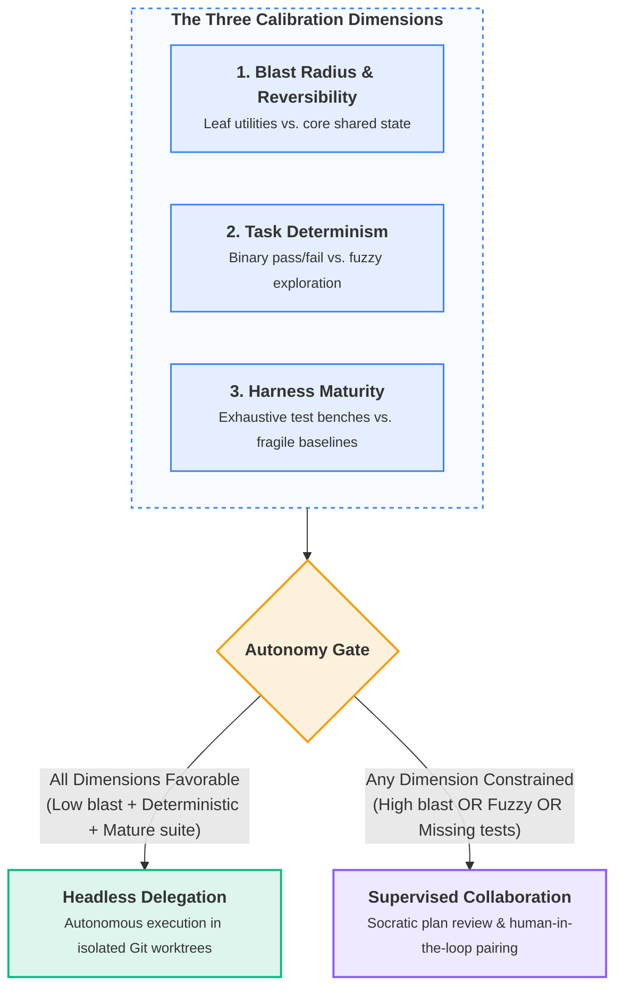
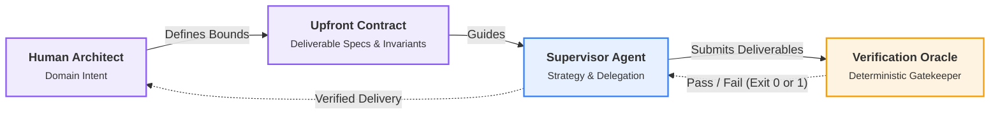
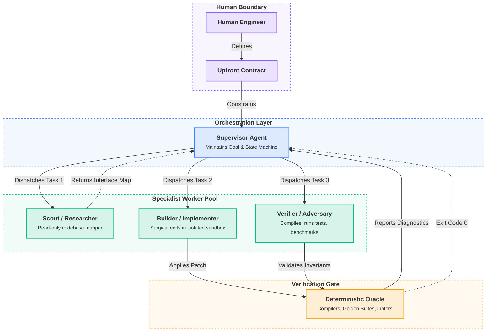

In any mature engineering organization, nobody knows every single line of code in the repository by heart. As systems scale beyond tens of thousands of lines, you inevitably work alongside peers, specialized contractors, and cross-functional teams. You do not spend your evenings memorizing their local loop indices or auditing every utility function character by character. Yet, despite this lack of line-by-line omniscience, senior engineers and technical leaders maintain complete, uncompromising ownership of their systems.

When developers begin working with autonomous AI coding agents, however, that healthy professional distance often evaporates. Instead of treating the agent as an independent contributor executing a bounded assignment, developers treat it like autocomplete on steroids. Because the agent lives directly inside their IDE or terminal, they remain trapped in "author" mode, expecting the code to mirror their personal typing habits, stylistic idiosyncrasies, and syntactic preferences.

The result is an exhausting psychological trap. Developers find themselves reading every token, local variable, and conditional branch like a human linter, quickly succumbing to severe review fatigue. Alternatively, overwhelmed by the sheer volume of generated text, they swing to the opposite reckless extreme: granting an agent unbounded access to the entire repository with vague prompts, then rubber-stamping opaque diffs without verifying whether the solution solves the core problem.

Both extremes stem from the same fundamental misconception: that autonomy means total freedom, or that code ownership requires memorizing every line of syntax. 

In production software engineering, we learned long ago that unconstrained systems inevitably drift toward entropy. High-performance software architectures (whether native graphics engines, real-time operating systems, or distributed microservices) achieve reliability precisely because they operate within rigid boundaries. Type systems, memory ownership models, encapsulation, and contract-driven interfaces do not suffocate computation; they are the exact scaffolding that allows complex systems to scale safely.

The exact same truth applies to autonomous AI agents. True technical ownership has never been about memorizing syntax; it is about **calibrated trust**. When we stop treating models as either brittle autocomplete tools or omnipotent oracles, and instead apply classical software engineering principles to their orchestration, agentic workflows transform from chaotic experiments into remarkably reliable engineering engines.

---

## 1. The Paradox of Autonomy and Calibrated Trust

> **The Architectural Rule:** Autonomy is not the absence of boundaries; it is the freedom to iterate independently within an airtight frame of reference.

Consider how we build native software in C++ or Rust. We do not let every subsystem write indiscriminately to arbitrary memory locations. We enforce memory boundaries, declare explicit data ownership, isolate side effects, and compile against strict static interfaces. These constraints are liberating: because the compiler guarantees invariants at boundaries, an individual module or algorithm can be refactored, optimized, and tested in complete isolation.

### The Human Colleague Parallel: Autonomy Without Alignment Is Entropy

Every seasoned engineering lead has witnessed this dynamic with human teams.

Consider what actually happens during an effective code review between experienced peers. When a senior colleague submits a pull request containing four hundred lines of new logic, how do you review it?

You do not begin by reading from line 1 to line 400 like a compiler. You examine the pull request description, the problem statement, and the interface boundaries. You verify which public functions were added or modified, how memory ownership is transferred, and how error states are handled. You scrutinize the test suite to see whether the author genuinely understood the failure modes, edge cases, and numerical boundary conditions. If the architectural contract is sound and the automated test suite passes, you deliberately choose not to micromanage whether an internal helper function used a standard `for` loop, a range-based loop, or an STL algorithm. You let automated linters and formatters enforce style rules.

Conversely, consider what happens when alignment is missing. If you assign an engineer, even a brilliant senior researcher, a vague high-level objective like *"improve the point cloud meshing module"* or *"refactor the scene graph"* without explicitly establishing architectural invariants and acceptance criteria, there is zero reason their work will align with the broader system. Left in an unconstrained vacuum, they will make entirely reasonable, well-intentioned local assumptions. Two weeks later, they submit a massive pull request with an incompatible coordinate system, an unauthorized third-party library, or an altered memory lifecycle that breaks downstream consumers.

We do not blame the engineer for this divergence; we recognize it as an organizational failure. Alignment never happens by osmosis, telepathy, or good intentions. Autonomy only succeeds when the playing field is explicitly delineated upfront: what constitutes success, which contracts are immutable, and how delivery will be verified.

Yet when working with AI coding agents, developers routinely swing between micro-managing syntax and offering unbounded freedom. They prompt an LLM with open-ended aspirations, provide zero boundary conditions, and then express shock when the model hallucinates an incompatible architecture or wanders off into circular edits.

* **✕ The Naive Trap (The Human Compiler / Unbounded Freedom):** Auditing every local variable like a human linter, or conversely, handing an agent an unconstrained prompt ("Implement feature X across the codebase") and hoping the model maintains discipline across dozens of file modifications.
* **✓ The Industrial Pattern (The Invariant Reviewer / Bounded Autonomy):** Establishing a rigid operational contract, isolating the agent within an ephemeral workspace, interrogating boundary interfaces and automated test proofs, and granting the contributor latitude on internal implementation mechanics.

### The Three Dimensions of Calibrated Autonomy

Trust in engineering is never binary; it is calibrated. When onboarding a new colleague or contracting agency, you do not grant them root access to the production payment gateway on their first morning. You start with isolated, well-defined tasks, evaluate their judgment and attention to edge cases, and progressively broaden their scope of autonomy as confidence grows.

Autonomy cannot be captured on a simplistic two-dimensional chart or reduced to an all-or-nothing toggle. It is an operational envelope determined by **three orthogonal dimensions**. High autonomy is only granted when all three conditions align. If even a single dimension is constrained, whether because the blast radius is dangerous or test coverage is non-existent, human oversight must immediately scale up.



1. **Blast Radius and Reversibility:** Always evaluate the cost of being wrong. Tasks located at the leaves of your dependency tree (file format parsers, serialization helpers, offline data converters, and automated test generators) have a tiny blast radius. If the implementation has a flaw, it cannot corrupt central application state, and reverting it is trivial. Conversely, core stateful orchestrators, persistent database schemas, and shared memory managers carry an enormous blast radius and demand close, hands-on architectural supervision.
2. **Task Determinism:** Grant high autonomy to tasks with clear, binary, and measurable success criteria. Optimizing an inner loop to hit a microsecond benchmark, porting an algorithm to pass a golden reference dataset, or reproducing and fixing a specific failing test are highly deterministic problems. The agent either succeeds or fails, and automated benchmarks provide immediate proof. By contrast, fuzzy, exploratory tasks (such as designing an open-ended user interaction model or deciding high-level business abstractions) require continuous human course correction.
3. **Verification Harness Maturity:** The autonomy you can safely grant an agent is strictly a function of your test harness maturity. If a subsystem has zero unit tests, fragile integration scripts, and undocumented invariants, you cannot safely delegate anything beyond trivial refactoring without paranoid line-by-line inspection. But if the subsystem is protected by rigorous differential tests, property-based invariants, and strict type checking, you can unleash an agent to execute large refactors with complete confidence. The harness, not human vigilance, enforces safety.

### Maintaining Code You Didn't Write by Heart

The deepest skepticism engineers voice about agent-generated code sounds like this: *"If an agent wrote this module, what happens at 2 AM six months from now when production crashes and nobody understands how it works?"*

This is a legitimate concern, but it reveals an uncomfortable truth about software development: you do not remember code you personally wrote six months ago either. Human memory fades quickly. When a production incident occurs in a complex system, nobody relies on photographic memory of lines of code.

What actually enables an engineer to diagnose and repair an unfamiliar subsystem, whether written by a former colleague, an external contractor, or an autonomous agent? Three foundational assets provide that confidence:

1. **Clean Interface Boundaries:** The component is strictly decoupled from the rest of the application. It receives explicit data inputs and produces explicit outputs, without hidden global state or unexpected side effects across architectural layers.
2. **Deterministic Test Suites:** The module is backed by comprehensive [differential and invariant test benches](/2026/08/22/ai-agents-reducing-technical-debt-in-rd.html#3-building-the-verification-safety-net-differential--invariant-testing). You can reproduce the failure deterministically with a single test case, trace the anomaly, and verify your fix without fearing silent regressions.
3. **Recorded Design Rationale:** The architectural intent, memory budgets, and deliberate trade-offs are documented in clear comments or design notes, rather than trapped in unwritten institutional folklore.

If an agent produces code behind clean interfaces, accompanied by exhaustive regression tests and explicit design rationale, that code is not alien debt. It is a well-engineered asset that any competent engineer can inspect, debug, and maintain.

---

## 2. The Upfront Contract and the Deliverable Bundle

> **The Insight:** Define problem boundaries, data ownership, and invariants before generating code; demand a design plan before authorizing implementation.

In classical software design, Bertrand Meyer introduced *Design by Contract*: the principle that software components should communicate through explicit preconditions, postconditions, and invariants. 

When orchestrating autonomous agents, the upfront contract established between the human architect and the agent is the single most decisive factor determining success or failure. Without this contract, autonomy degenerates into guesswork.



Before delegating any multi-step task to an agent, the human architect must define three explicit contractual elements:

### Preconditions, Postconditions, and Invariants

1. **Preconditions (The Baseline):** What must hold true before execution starts? The target branch must be clean and passing existing builds. The problem must be anchored to a reproducible test case, a golden baseline dataset, or an explicit issue specification. Permitted file paths must be strictly demarcated (for example, only files inside `src/geometry/` and `tests/geometry/`).
2. **Postconditions (The Definition of "Done"):** What state proves completion without requiring human eyeball review? All newly introduced unit and property tests must pass. Zero regressions may occur across existing test suites. Linters and static analysis must exit with zero warnings.
3. **Invariants (Non-Negotiable Boundaries):** What constraints must remain untouched throughout execution? Public API signatures and serialization schemas must remain backward-compatible. Core memory layout rules (contiguous buffers, zero-allocation loops) must be preserved. No new external dependencies may be added to package manifests without authorization.

---

### Practical Contract Construction: The "Grill Me" Pattern

A natural objection arises: does establishing an upfront contract require the human architect to spend hours authoring tedious, formal specifications before writing any code?

The answer is no. You should not write the contract in a vacuum; you should let the agent extract it from you.

This technique, popularized by Matt Pocock through his `grill-with-docs` pattern, flips the conversational dynamic. Instead of dumping a loose idea and immediately asking the agent to code, you instruct the agent (or supervisor) to aggressively interview you first using an explicit prompt:

```text
Do not write any implementation code yet.
Review my high-level intent and target files.
Your goal is to grill me: interrogate my assumptions, uncover edge cases, probe memory and performance constraints, and resolve architectural ambiguities.
Ask exactly one question at a time, providing concrete options or recommendations where possible.
Continue grilling me until we reach an airtight, shared understanding.
Once complete, synthesize our answers into a formal contract defining preconditions, postconditions, invariants, and the expected deliverable bundle.
```

This Socratic alignment loop works remarkably well for three reasons:

1. **Surfacing Hidden Assumptions:** Humans carry immense implicit domain knowledge (such as knowing that coordinate systems must remain right-handed, or that an internal loop cannot allocate on the heap) that we routinely forget to write down. An agent trained to grill you will prompt you for these exact boundaries.
2. **Low-Friction Iteration:** An interactive interrogation keeps cognitive load low. Rather than staring at a blank specification document, the engineer simply answers targeted, concrete questions or chooses between proposed trade-offs.
3. **Automated Contract Synthesis:** Once the grilling concludes and both parties reach shared clarity, the agent synthesizes the entire interview transcript into the formal upfront contract: pre-populating the preconditions, postconditions, and invariant checklists before any specialist worker is spawned.

---

### The Expected Deliverable Bundle: Moving Beyond Raw Code

A common mistake in agent workflows is defining the expected delivery as merely "a code change." In production engineering, raw code without verification artifacts is indistinguishable from technical debt. 

When a human delegates to an agent (or when a supervisor delegates to a specialist worker), the delivery must be structured as an explicit, verifiable bundle containing four distinct components:

1. **The Scoped Patch:** A minimal, surgical diff strictly restricted to the authorized target directories. Any modification to adjacent files, unrequested style changes, or speculative refactoring causes the delivery to be rejected immediately.
2. **The Verification Test Harness:** Tangible unit, regression, or property-based tests that prove the new capability works and explicitly test the edge cases where the previous logic failed.
3. **The Invariant Compliance Audit:** Explicit evidence that non-negotiable boundaries were respected. For native systems, this includes ensuring zero heap allocations in inner loops, checking binary ABI compatibility, or confirming that serialized schema formats match existing versions.
4. **The Execution Transcript:** The unedited terminal output from the compiler, test runner, and linter proving that the code was compiled and executed cleanly.

If a worker returns an incomplete bundle (such as a code diff without an execution transcript or corresponding tests), the supervisor treats the task as unfinished, regardless of how polished the code appears.

---

## 3. The Oracle Problem: Why Agents Cannot Grade Their Own Work

Why do unconstrained agents fail so reliably at determining whether a task is complete? Because of the **Self-Assessment Fallacy**.

When an engineer asks a large language model *"Did you complete the task? Does your implementation work?"*, the model almost always replies with cheerful confidence. Large language models are probabilistic pattern-matchers trained to generate agreeable prose. They suffer from systemic confirmation bias: if they generate code that looks plausible, they will naturally assert that the code is correct.

> **The Insight:** Never let an agent grade its own homework. An agent cannot be its own oracle.

In computer science and testing theory, an **oracle** is an external, independent mechanism capable of distinguishing correct program execution from incorrect execution. To make autonomous agents truly functional, the definition of "done" must be decoupled from the model's self-perception and handed over to deterministic oracles.

Industrial agent orchestration relies on three distinct oracle archetypes:

### 1. Differential and Golden Reference Oracles
When porting algorithms or optimizing pipelines (as we explored in [*The Translation Problem*](/2026/07/24/the-translation-problem.html)), the most powerful oracle is a golden reference. The supervisor provides the agent with an immutable dataset and its expected outputs (for example, a Python or NumPy reference implementation or serialized test vectors). The agent's native C++ implementation is only accepted when its output matches the golden reference within an exact numerical epsilon tolerance across every test case.

### 2. Property-Based and Metamorphic Oracles
For complex algorithms where pre-computing golden outputs for every scenario is impossible, property-based testing (such as QuickCheck or Hypothesis) acts as an oracle. The oracle tests high-level mathematical invariants across thousands of randomized inputs:
* In geometry processing: coordinate transformations must be invertible, and bounding boxes must strictly enclose all mesh vertices.
* In image processing: applying a lossless compression step followed by decompression must yield bit-identical arrays.
* In spatial algorithms: scaling an input by a scalar factor must scale the resulting volume by the cube of that factor.

### 3. Syntactic and Semantic Gatekeepers
The fastest oracles are static compilers and type checkers (`clang++ -Wall -Werror`, `mypy --strict`, `cargo check`). They provide an immediate, unambiguous binary verdict: either the code complies with language rules and type contracts, or it does not.

> **The Oracle Rule:** A task is never "done" because an agent claims it is done. A task is done when an external, deterministic oracle executes and returns exit code 0.

---

## 4. The Supervisor-Specialist Hierarchy: Decoupling Strategy from Execution

A common anti-pattern in agentic design is the monolithic generalist: assigning a single agent to understand requirements, explore a 50,000-line codebase, write native code, debug compiler errors, and evaluate its own solution. This violates one of the oldest principles in software engineering: the **Single Responsibility Principle (SRP)**.

A far more robust architecture mirrors classical distributed systems and supervisor trees (such as those pioneered in telecommunications and Erlang OTP): **decoupling strategic orchestration from tactical execution**.



In this model, the system is organized across four clearly differentiated layers:

### The Supervisor Agent (The Orchestrator)
The supervisor is responsible for strategy, state tracking, and contract validation. It does not write lines of implementation code. Instead, it:
1. Ingests the human contract and breaks the objective down into a sequence of small, verifiable milestones.
2. Formulates precise, single-purpose task briefs for specialized workers.
3. Evaluates worker deliverable bundles against contractual postconditions and oracle execution transcripts.
4. Handles failures, retries, and task rescheduling when a worker hits a dead end.

### The Specialist Worker Pool (The Executors)
Workers are ephemeral, stateless agents assigned to one specific responsibility at a time:

* **The Scout (Information Gathering):** Equipped solely with read-only search and inspection tools. Its only job is to explore the repository, locate immediate callers, trace class hierarchies, and return a concise architectural summary of relevant interfaces. It produces no code diffs.
* **The Builder (Surgical Implementation):** Receives the scout's concise summary and the specific file paths to modify. It works within an isolated workspace, making minimal, targeted edits to satisfy the required behavior.
* **The Verifier (The Adversary):** Takes the builder's deliverable bundle and subjects it to the verification oracle. It crafts boundary-condition tests, executes differential checks against golden data, and verifies property invariants.

By separating these roles, context windows remain lean, clean, and focused on one cognitive mode at a time. The builder is not distracted by the vastness of the full repository; the supervisor is not bogged down by low-level syntax errors.

### Applying Classical Engineering Principles to the Worker Sandbox

When we bring workers into existence, how do we prevent them from corrupting the system? We apply three foundational engineering concepts:

1. **Information Hiding (David Parnas, 1972):** In modern software design, information hiding ensures modules only expose what clients strictly need to know. In agentic workflows, information hiding is essential for context management. Dumping an entire project into an agent's context window dilutes attention and invites hallucinations. Instead, the supervisor provides the worker with strictly scoped context: the target interface header, the immediate caller, and the failing test case.
2. **Ephemeral Workspaces and Fault Isolation:** In fault-tolerant computing, when a process exhibits anomalous behavior, the supervisor terminates it and cleans up its state. Never let an agent work directly on a shared working tree without isolation. Every builder worker should operate in a dedicated, isolated sandbox (such as a separate Git worktree). If the worker generates broken abstractions or gets stuck in a confused loop, the supervisor simply kills the worker, deletes the temporary worktree, and starts fresh with updated diagnostic guidance. No corrupted state leaks into the main branch.
3. **Fast Deterministic Feedback Loops (TDD as Senses):** An autonomous agent cannot succeed if its only feedback mechanism is human review. It must have immediate access to deterministic tools: compilers, type-checkers, test runners, and profilers. When a worker modifies code, it runs the test suite locally. The compiler output and stack traces serve as immediate sensory feedback, allowing the agent to diagnose syntax errors, fix typing mismatches, and refine its implementation autonomously before ever reporting back to the supervisor.

* **✕ The Naive Trap (Conversational Prompting):** Asking an agent to "review its own work carefully" and hoping it notices mistakes through internal self-reflection.
* **✓ The Industrial Pattern (Deterministic Oracles):** Hooking the agent directly into the native build and test harness so failures produce immediate, unambiguous compiler and runtime errors.

> **💡 Low-Budget / Single-Machine Setup:**
> You do not need an elaborate distributed cloud infrastructure to implement this supervisor-specialist architecture. A single developer workstation using Python, standard Git worktrees (`git worktree add`), and local subprocesses for compilation and test execution can effortlessly orchestrate multi-agent workflows. The architectural rigor lies in the contracts and boundaries, not in complex cloud tooling.

---

## 5. Software Engineering Discipline Is More Relevant Than Ever

There is a superficial narrative circulating in tech circles that autonomous AI agents will make classical software engineering principles obsolete. Some argue that if machines can write code at lightspeed, clean architecture, modularity, and explicit interfaces no longer matter.

The reality is the exact opposite.

A chaotic, tightly coupled codebase with missing tests and tangled global state will paralyze even the most advanced reasoning model. The agent will drown in side effects, break hidden dependencies, and generate incomprehensible regressions. 

Conversely, a codebase designed with classical rigor: clear boundaries, high cohesion, low coupling, comprehensive test harnesses, and explicit contracts: is an environment where autonomous agents thrive. In such systems, a supervisor can reliably spin up specialized workers, delegate scoped tasks, verify results with deterministic oracles, and merge pristine pull requests with minimal human friction.

### Integrating the Architecture into Daily Workflows

The beauty of this architecture is that it requires no exotic new project management paradigm. It integrates seamlessly into the exact version control and issue tracking workflows engineering teams have refined for decades:

1. **Textual Proof of Contract (The Epic or Issue):** Once the human architect and the supervisor reach a shared understanding through the Socratic grilling session, the supervisor opens a parent epic or issue. This ticket serves as the immutable, transparent record of the contract: documenting the preconditions, postconditions, invariant checklists, and verification oracles.
2. **Task Delegation to Workers:** The supervisor breaks down the epic into granular, single-responsibility sub-tasks. Specialist workers (scouts, builders, verifiers) take on individual tickets, operating within ephemeral Git worktrees.
3. **Traceable Deliveries (Merge Requests):** Deliveries are submitted as standard Merge Requests (MRs or PRs). Each MR contains the scoped patch, the verification test harness, and automated CI/CD oracle runs confirming exit code 0.
4. **Transparent Audit Trails:** In the issue tracking thread, the supervisor and workers post structured comments explaining the specifics implemented, highlighting trade-offs made, and attaching the verification transcripts.

The human architect retains ultimate editorial veto and merge authority, but the entire lifecycle: from intent to specification, delegation, execution, and verification: is auditable, repeatable, and completely grounded in engineering discipline.

As engineers, our role is not disappearing; it is maturing. We are graduating from being line-by-line typists to becoming systems architects. By establishing rigorous upfront contracts, practicing calibrated trust, and orchestrating supervisor-worker hierarchies, we unlock the true promise of agentic autonomy: reliable, high-velocity engineering grounded in timeless principles.

> *Automated code generated without verified intent is merely technical debt arriving at the speed of light. True engineering leverage lies in owning the why, defining the boundaries, and letting automated proof do the rest.*
