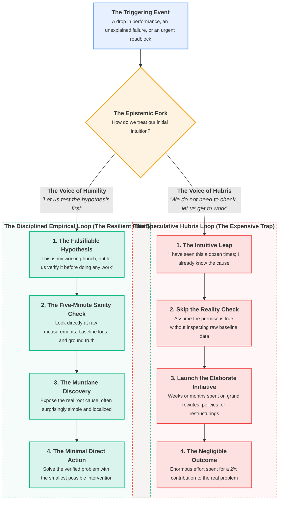

In software engineering and computer science, I have witnessed this scene play out dozens of times.

An application experiences an unexpected latency spike or performance drop. The team gathers, anxious for a quick resolution. A seasoned engineer, carrying fifteen years of systems programming pedigree and deep mathematical competence, looks at the system diagram and announces with absolute certainty: *"I know exactly what is happening here. The spatial KD-tree traversal is choking on boundary queries. We need to vectorize the inner loop and rewrite the core data structure."*

The room exhales. The diagnosis sounds authoritative, sophisticated, and thoroughly plausible. The engineer retreats into the codebase for three uninterrupted days of high-intensity work, hand-crafting intricate logic and introducing complex optimizations. The resulting pull request is a tour de force of technical prowess. It is reviewed with admiration and merged.

Then the system runs in production. The performance improvement? Barely two percent.

Only then does someone finally attach a basic profiler. A thirty-second trace reveals an embarrassing truth: seventy-five percent of the execution time was not spent inside the mathematical kernel at all. It was consumed by an innocent-looking logging utility formatting strings in an inner loop, and a hidden heap allocation inside a standard container copy. Many days of exhausting, high-IQ labor produced a virtually nonexistent contribution to the real problem.

While computer science provides a clean case study because profilers produce unequivocal numbers in seconds, this dynamic is not unique to software. It is a universal human pattern. 

From politics and public policy to industrial manufacturing and academic research, the most expensive waste of talent occurs when capable people lack the humility to **check the hypothesis first before considering the work relevant to be done**.

---

## 1. The Trap of Competence: When Experience Skips the Reality Check

> **The Problem:** The most expensive waste of talent in any field is doing a magnificent job solving a problem that does not exist.

When beginners encounter an unexpected roadblock, they proceed with natural caution. Because they know their understanding is incomplete, their instinct is to observe reality before attempting an intervention. They read the manual, inspect the raw numbers, ask naive questions, and test their assumptions step by step. Their very lack of confidence acts as an epistemic shield, forcing them to verify the ground beneath their feet.

As we accumulate years of experience, however, our cognitive posture shifts. We solve dozens of hard problems, master professional vocabularies, and develop sharp intuition. We build sophisticated internal representations of how our domain operates.

These mental models are essential. They allow experienced professionals to triage chaos quickly and filter out dead ends. But experience carries a subtle cognitive trap: **we begin confusing our mental model with reality itself**.

When an expert says *"the problem has to be X"*, they are rarely observing the current reality with fresh eyes. Instead, their brain is instantly pattern-matching against memories of past battles. They assume that because a certain failure mode occurred in three previous projects, it must be the culprit today.

### The Anatomy of the Two Paths

The difference between effective problem-solving and costly organizational churn comes down to a single choice:

| Operational Dimension | The Speculative Hubris Loop | The Disciplined Empirical Loop |
| :--- | :--- | :--- |
| **Mental Posture** | **Certainty:** "I have seen this before; I already know what needs to be done." | **Curiosity:** "My experience gives me a good guess, but let us verify it first." |
| **First Action** | Immediately planning and executing the solution. | Running a quick, direct reality check against real data. |
| **Effort Invested** | Days, weeks, or months of complex, high-friction work. | Minutes spent observing before committing any resources. |
| **Emotional Focus** | Proving expert competence through cleverness and ambition. | Finding the truth as quickly and simply as possible. |
| **Long-Term Impact** | Unnecessary complexity, wasted budget, and unaddressed problems. | Clean solutions, high team trust, and durable results. |

Why do capable professionals resist the simple reality check?

Because checking feels pedestrian. Running a basic diagnostic or asking a fundamental question does not feel like the work of an expert. Designing a grand restructuring, developing a complex theoretical model, drafting sweeping policy, or writing hundreds of lines of intricate code feels important, intellectual, and prestigious.

Even more subtly, checking risks disproving our intuition. Our ego naturally craves the satisfaction of having been right on the first guess. By jumping straight into the solution, we protect our hunch from being contradicted, right up until reality inevitably catches up with us.

---

## 2. The Universal Illusion: From Politics to Industry

> **The Universal Rule:** The physical world, whether it is a citizen, a factory line, an operating room, or a computer chip, does not care about your pedigree; it obeys only the actual laws of its environment.

When you look closely across industries, you find this exact same failure mode repeating itself with astonishing regularity:

### In Politics and Public Policy
A municipal government observes traffic congestion in a growing city. Policy experts, relying on ideological conviction and theoretical transportation models, draft hundreds of pages of legislation and allocate tens of millions of dollars to build an elaborate new interchange. Two years later, congestion has not improved. 

Why? Because nobody spent three days sitting at the problematic intersection observing traffic in person. Had they checked the ground truth, they would have discovered that eighty percent of the gridlock was caused by poorly synchronized traffic lights two blocks away and an ambiguous delivery loading zone. A five-thousand-dollar software timing adjustment would have solved the problem that a fifty-million-dollar construction project failed to touch.

### In Industrial Manufacturing and Corporate Strategy
An industrial plant experiences declining delivery reliability and rising defect rates. Senior management immediately commissions an expensive, multi-year digital transformation. They hire external consultants, install complex enterprise resource planning systems, and reorganize team hierarchies. 

Months of organizational friction follow, yet defect rates remain unchanged. When a shop-floor technician finally investigates the baseline assembly process, the real cause is discovered: an uncalibrated torque wrench at station four, and a supplier whose bolt tolerances were off by half a millimeter. The grand corporate transformation was completely irrelevant to the physical failure.

### In Scientific Research and Academia
Researchers often spend months reviewing related literature, citing dozens of prior studies, and developing elaborate mathematical frameworks, building an entire publication on top of an unverified premise. Had they taken forty-eight hours to run a simple, unglamorous baseline experiment, they would have discovered that their initial premise was flawed from the start.

### In Software and Systems Engineering
The engineer who spends three full days hand-tuning assembly intrinsics and rewriting spatial algorithms to optimize a routine that accounts for two percent of wall-clock time, while ignoring the seventy-five percent bottleneck sitting in plain sight in a standard logging call.

In every domain, the error is identical: **we fall in love with the work before checking whether the premise is true**.

* **✕ The Speculative Trap:** Jumping straight into "related works", complex roadmaps, and massive initiatives based on an unverified intuitive diagnosis.
* **✓ The Disciplined Habit:** Demanding a simple, direct measurement to prove the problem exists where we think it does before authorizing a single hour of implementation.

---

## 3. The Five-Minute Sanity Check: A Universal Protocol

Cultivating intellectual humility is not an abstract virtue; it is an everyday operational habit. Before anyone on your team commits days or weeks of work to a solution, follow this simple protocol:

### 1. State the Underlying Hypothesis Explicitly
Before approving any project, policy, or proposed redesign, ask one question: *"What specific assumption must be true for this work to be relevant?"* Write that assumption down in plain language.

### 2. Find the Simplest Direct Measurement
Do not debate the theory in conference rooms. Look directly at the ground truth:
* **In software:** Attach a profiler, inspect the trace, or check memory allocations before touching code.
* **In product and business:** Watch five real customers use the product, or read thirty unedited customer support tickets yourself.
* **In operations and industry:** Go to the physical floor, shadow the technician, and inspect the physical tools.
* **In management:** Speak directly with the frontline contributors who do the daily work before redesigning organizational charts.

### 3. Seek to Disprove Your Hunch First
The mark of true professional maturity is actively trying to invalidate your own theory. Ask: *"What piece of evidence would prove that my initial hunch is completely wrong?"* If the data contradicts your intuition, discard the idea immediately. Do not mourn the lost theory; celebrate that you discovered the truth in ten minutes instead of ten weeks.

### 4. Choose the Simplest Intervention First
Once the real root cause is isolated, resist the urge to over-engineer the remedy. The most effective solution is almost always the most modest one: adjusting a timer, clarifying a single sentence on a form, replacing a worn bolt, or hoisting an invariant out of a loop.

> **💡 The Low-Budget Reality Check:**
> You rarely need complex tooling, massive studies, or expensive consultants to verify a premise. A twenty-line script, a single customer conversation, or an hour spent observing the physical workflow will puncture days of speculative debate in a matter of minutes.

---

## 4. Radical Humility as a Professional Superpower

There is an unmistakable progression that occurs over the course of a healthy career:

* **The Novice Phase:** Believes seniority means knowing the answer to every question immediately.
* **The Intermediate Phase:** Believes seniority means designing the most complex, sophisticated solutions to prove professional mastery.
* **The Mature Senior Phase:** Understands that human intuition is fallible, distrusts their own cleverness, and takes pride in disproving their own assumptions in five minutes with hard facts.

True maturity is characterized by **radical intellectual humility**. It is the confidence to say in front of your team: *"My initial theory was that our issue was caused by X. I went and looked at the actual baseline data this morning, and I was completely wrong. The real bottleneck is Y, and we can resolve it this afternoon with a minor adjustment."*

When leaders model this behavior, it transforms the culture around them:

1. **It Eliminates the Fear of Being Wrong:** When colleagues see a senior leader openly discard their own assumptions in the face of facts, they stop hiding their own uncertainties. They feel safe to experiment, measure, and bring real data to the table without fear of being penalized.
2. **It Protects Organizations from Waste:** It stops teams from burning their creative energy and budget on phantom problems, keeping everyone focused on work that delivers genuine, measurable value.
3. **It Keeps Systems Simple:** Convoluted legislation, bloated organizational hierarchies, and over-engineered software are almost always monuments to someone's unchecked ego. Simple, durable solutions are the quiet signature of people who took the time to verify reality first.

---

## The Liberation of Checking First

Letting go of the need to be intuitively right is deeply liberating.

You no longer have to carry the exhausting pressure of pretending to foresee how complex, dynamic systems will behave in advance. You do not need to defend a flawed theory out of pride, nor do you have to double down on an ineffective project to save face.

Reality does not care about our status, our title, or how many years we have spent in the field. It simply is what it is.

Checking our hypothesis before we build is not an admission of weakness; it is the ultimate expression of respect for reality. When we embrace the humility to look before we leap, we save our teams from months of wasted effort, and we discover the quiet satisfaction of solving real problems with simple, enduring elegance.

> *True professional maturity is not measured by how often your intuition is right, but by how quickly you have the humility to test whether it is true before doing the work.*
