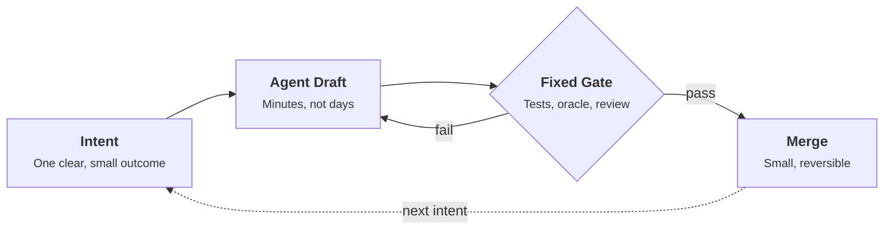

A prototype appears before the planning meeting is over.

Not a sketch, a working branch: code, a few tests, a plausible README. And yet the team does what it has always done. It schedules a review for Thursday, files the result under next sprint, and waits for the ritual to catch up with the work.

This is the quiet waste of the agentic era. We adopted tools that changed the cost of implementation by an order of magnitude, and we kept the rhythm designed for the old price.

The opposite reflex is just as dangerous. Once code is cheap, the temptation is to skip the slow parts: the review, the regression run, the check against real data. Production does not care how fast the code was written. Real scans are still noisy, memory is still finite, and a silent regression still costs the same to find on a Friday night.

The answer is neither to keep the old cadence nor to abandon discipline. It is to make the loop short and the gate fixed.

---

## 1. Rituals Were Priced for Slow Typing

> **The Problem:** Our cadences were sized for expensive implementation, and we keep paying for a cost that no longer exists.

Every ritual in a delivery process exists because something was expensive. Two-week sprints amortize the cost of building. Detailed specs protect against building the wrong thing at great length. Weekly syncs exist because handing work over took days.

When implementation takes minutes, these rituals do not become harmless. They become the bottleneck. A feature that is drafted in an hour and then waits nine days for a planning slot has not been accelerated, it has been parked.

The mistake is to treat the rituals as the process. They are only a way of paying for a cost. Once the cost drops, the honest question is not how to fit agents into the sprint, but which of these rituals still protects against something real.

Two costs did not move. Verifying that the result is correct still takes as long as it ever did, and deciding what to build next still takes human judgment. Everything tied to those two costs stays. Everything tied to typing speed should be questioned.

## 2. The Loop Shrinks, the Gate Does Not

> **The Architectural Rule:** The loop is elastic, the gate is an invariant. Compress everything before the gate, and never negotiate what happens at it.

The structure that works is small enough to fit in one diagram:

Everything left of the gate is allowed to speed up as much as the tools permit. The gate itself is defined once, in advance, and does not bend to the pace: deterministic tests, golden datasets, and a human sign-off on anything irreversible. If the loop is fast and the gate is fixed, a wrong draft costs a few minutes. If the loop is fast and the gate is soft, a wrong draft costs a release.

This changes what a cadence looks like:

* **✕ The Ceremony Around the Agent:** Weekly planning, two-week sprints and Thursday reviews wrapped around work that finishes in an afternoon. The agent idles, the human queues, and the calendar sets the speed.
* **✓ The Intent-to-Merge Loop:** Planning reduced to choosing the next small intent, a draft in the same day, a gate that answers in minutes, and a merge that is small enough to revert. The gate sets the speed, and the calendar only records it.

> **💡 Low-Budget / Single-Machine Setup:**
> You do not need a new process framework. One command such as `make check` that runs your tests and a golden-data comparison is the gate. One short-lived branch per intent is the loop. If the command is fast and honest, the rhythm follows on its own.

## 3. What Stays Human

> **The Insight:** The scarce resource moved from typing to deciding. A faster loop only pays off if someone keeps feeding it good intents and keeping the gate honest.

When drafts are nearly free, the quality of the work depends on three things that agents do not supply on their own.

First, the choice of the next intent. A small, well-scoped outcome makes the loop fast and the failure cheap. A vague one produces a large draft that is expensive to judge, which quietly rebuilds the old bottleneck at the review stage.

Second, the definition of the gate. What counts as correct on real data, and how to check it mechanically, is engineering judgment that has to exist before the first draft, not after it.

Third, the sign-off on what cannot be undone. Merging a reversible change is a routine step. Migrating data, changing a public contract or shipping to clients is a decision, and it stays one.

None of this is new. It is the same discipline of small steps and honest checks, now running at a different speed. The teams that benefit are not the ones that type fastest, but the ones that know exactly what done means.

---

Speed in the agentic era is not a matter of how quickly we generate, but of how quickly we can be sure. Shrinking the loop rewards us with tempo, and keeping the gate fixed is what lets us trust it. The people doing the work gain the most from this: less waiting, less ceremony, and more time spent on the decisions that only they can make.

> *Shrink the loop as far as the tools allow, and keep the gate exactly where it was: speed is only worth what you can verify.*
