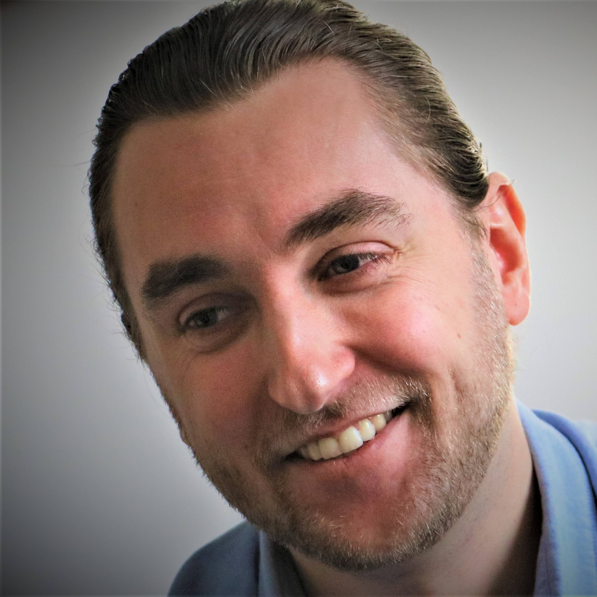
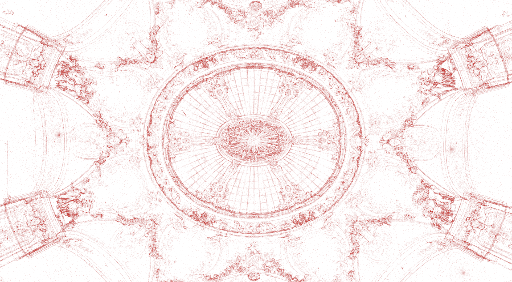
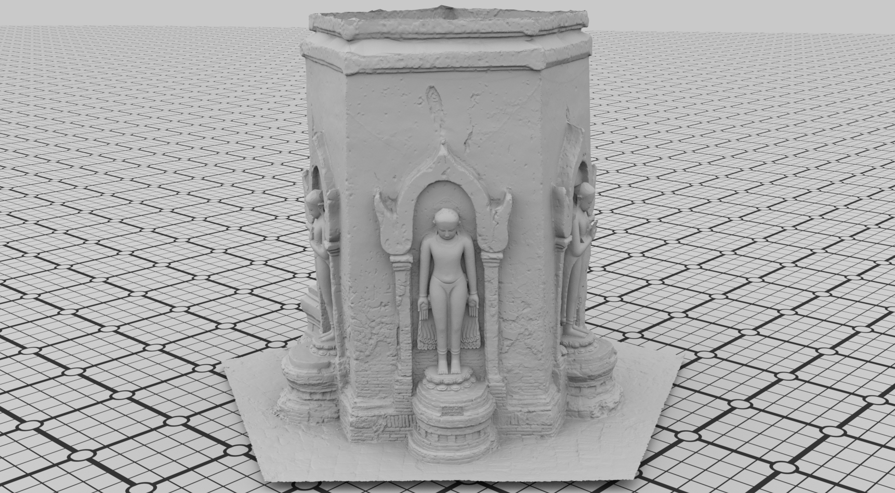

  

# Arnaud Bletterer

Research Scientist, Research Team Leader

*Computer Graphics, Image/Geometry processing, Machine learning*

    <a href="media/arnaud-bletterer-cv.pdf" target="_blank" class="pdf-link">PDF Version</a>
|   <a href="mailto:arnaud.bletterer@gmail.com" target="_blank">Mail</a>
|   <a href="https://www.linkedin.com/in/arnaud-bletterer-5635b671/" target="_blank">LinkedIn</a>
|   <a href="https://twitter.com/abletterer" target="_blank">Twitter</a>
|   <a href="https://ko-fi.com/abletterer" target="_blank">Ko-fi</a>

I am a **curious** research scientist and leader with a **12-year track record** of **bridging the gap between exploration and industrialization**. I possess a particular proficiency at **identifying and implementing practical, production-ready solutions** to complex real-world challenges, with an **Occam's razor perspective** as often as possible.

My core philosophy is that **research and development** must remain directly aligned with **final software deliverables**, ensuring a **seamless and rapid transition** from innovation to commercial implementation.

*"Bernard of Chartres used to compare us to dwarfs perched on the shoulders of giants. He pointed out that we see more and farther than our predecessors, not because we have keener vision or greater height, but because we are lifted up and borne aloft on their gigantic stature."* [John of Salisbury]

## Employment

`Since March 2023`
**Research Team Leader** & **Research Engineer** at [Quartier Latin](https://qlatin.com){:target="_blank"} *(Since Jan 2026)* & [QuantifiCare](https://quantificare.com){:target="_blank"} *(Mar 2023 - Dec 2025)*

* **Led and mentored** up to 7 researchers, aligning activities with production deliverables.
* **Professionalized workflows** by introducing automated validation pipelines for image processing and AI.
* **Supervised clinical research**, co-authoring publications on acne grading (2024) and vitiligo assessment (2025).

`December 2018 - March 2023`
**Research Engineer** at [QuantifiCare](https://quantificare.com){:target="_blank"}

* **Validated and industrialized** a 3D reconstruction algorithm robust to camera decalibration for daily clinical use.
* **Developed a fully autonomous face-stitching method** that tolerated acquisition errors, reducing user constraints and securing consistent model delivery.
* **Exchanged regularly with development teams** to integrate innovative methods and ensure seamless coherence with final software deliverables.

`October 2014 - December 2018`
**Ph.D Student** at [I3S Laboratory](https://www.i3s.unice.fr/en/){:target="_blank"} (MediaCoding team) in collaboration with Cintoo

* **Researched and developed** novel graph-based algorithms for the compression and out-of-core resampling of massive terrestrial LiDAR point clouds.
* Author of the thesis: *[A graph-based approach for modeling and processing gigantic point clouds from terrestrial LiDAR acquisitions](https://theses.hal.science/tel-02099777){:target="_blank"}*.

## Education

`2018`
__Ph.D in Automatic, Signal and Image Processing__, Université Côte d'Azur

`2014`
__Master in Computer Science__, Université de Strasbourg

`2012`
__Bachelor in Computer Science__, Université de Strasbourg

## Skills

**Computer science**

* `OpenCV/Pillow` Image processing *(convolution filters, superpixel segmentation)*
* `Meshlab/IGL` Geometry processing *(3d reconstruction, mesh processing)*
* `Pytorch/scikit-learn` Machine learning *(neural networks, PLS regression, morphable models)*
* `OpenGL/WebGL` Computer graphics *(multi-pass/multi-scale rendering, texturing)*
* `Visual Studio/Visual Studio Code` Programming *(C, C++, Python)*
* `Gitlab/Gitea` Code versioning *(Git)*
* `WSL/Arch Linux` Systems *(Windows, MacOS, Linux)*

**Languages**

| French 🇫🇷 : native speaker | German 🇩🇪 : school level |
| English 🇬🇧/🇺🇸 : professional use | Russian 🇷🇺 : beginner |

## Miscellaneous

I love spending my free time:
* doing photography 📸 (you can find some of my work [here](https://sceyonara.abletterer.synology.me/){:target="_blank"} and [there](https://www.instagram.com/sceyonara/){:target="_blank"})
* doing recreative programming 👨‍💻
* generating beautiful renderings with Blender 
* playing bass guitar 🎸

## Publications

I mostly published prior to joining the industry, in the fields of **point cloud processing** and **3D reconstruction from LiDAR acquisitions** of cultural heritage sites.
More recently, my research interests have also expanded towards **image processing** and **machine learning** of medical images.

`2025`
**Objective Assessment of Target Vitiligo Areas by Semiautomatic Analysis of Standardized UV Images**   Charles Jabour, <ins>Arnaud Bletterer</ins>, Thierry Passeron. *JAMA dermatology*

`2024`
**Automatic Acne Severity Grading with a Small and Imbalanced Data Set of Low-Resolution Images**   Rémi Bernhard, <ins>Arnaud Bletterer</ins>, Maëlle Le Caro, Estrella García Álvarez, Belchin Kostov, and Diego Herrera Egea. *Dermatology and Therapy*

  
  

`2022`
**Graph-based Computation of Voronoi Diagrams on Large-scale Point-based Surfaces**  <ins>Arnaud Bletterer</ins>, Frédéric Payan, and Marc Antonini. *Eurographics*

`2020`
**A local graph-based structure for processing gigantic aggregated 3D point clouds**  <ins>Arnaud Bletterer</ins>, Frédéric Payan, and Marc Antonini. *IEEE TVCG*

`2018`
**Out-of-core Resampling of Gigantic Point Clouds**  <ins>Arnaud Bletterer</ins>, Frédéric Payan, Marc Antonini, and Anis Meftah. *SGP*

`2016`
**Point cloud compression using depth maps**  <ins>Arnaud Bletterer</ins>, Frédéric Payan, Marc Antonini, and Anis Meftah. *Electronic Imaging*

You can find the exhaustive list on [Google Scholar](https://scholar.google.com/citations?user=fEbApYQAAAAJ){:target="_blank"}
