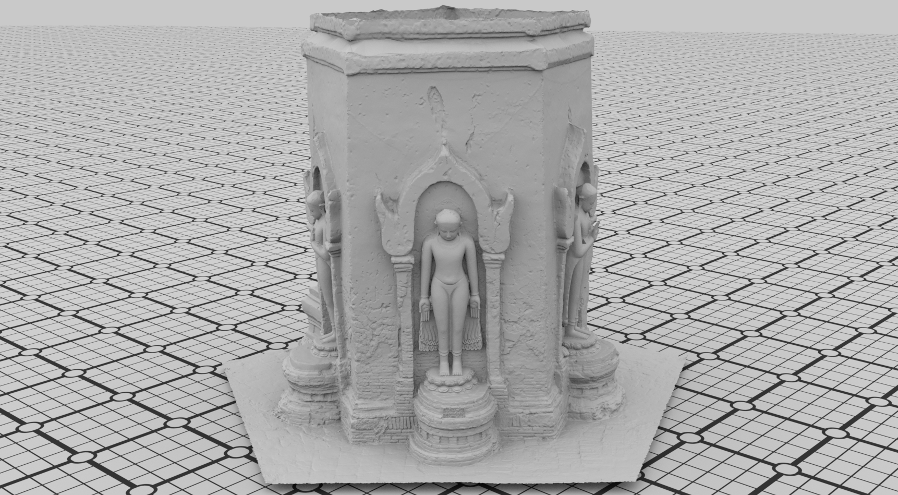

## 

# Arnaud Bletterer 

Research scientist, Research Team Leader

*Computer Graphics, Image/Geometry processing, Machine learning*

    <a href="mailto:arnaud.bletterer@gmail.com" target="_blank">Mail</a>
|   <a href="https://www.linkedin.com/in/arnaud-bletterer-5635b671/" target="_blank">LinkedIn</a>
|   <a href="https://twitter.com/abletterer" target="_blank">Twitter</a>

I am a **curious** individual, always striving to **question and solve challenging real-world problematics**.  
I have developed a particular proficiency at **identifying and implementing practical solutions**, with an **Occam's razor perspective** as often as possible.  
I love **explaining** how things work, and **identifying** how they can be improved.

*"Bernard of Chartres used to compare us to dwarfs perched on the shoulders of giants. He pointed out that we see more and farther than our predecessors, not because we have keener vision or greater height, but because we are lifted up and borne aloft on their gigantic stature."* [John of Salisbury]

## Employment

`Since March 2023`
**Research team leader** at [QuantifiCare](https://quantificare.com){:target="_blank"}

* Interacting weekly on research works progression and priorities management
* Presenting and organizing R&D team activities

`Since December 2018`
**Research engineer**/**Technical lead** at [QuantifiCare](https://quantificare.com){:target="_blank"}

* Interacting daily with R&D engineers on technical solutions conception
* **Conception**, **implementation** and **validation** of algorithms in different softwares produced by QuantifiCare
  * 3D reconstruction from stereo-images
  * Rigid/Non-Rigid meshes registration
  * Mesh texturing
  * 3D visualization

`2014 - 2018`
**Ph.D student** at [I3S Laboratory](https://www.i3s.unice.fr/en/){:target="_blank"} in the [MediaCoding team](https://mediacoding.i3s.unice.fr){:target="_blank"} and in collaboration with [Cintoo](https://cintoo.com/){:target="_blank"}

[A graph-based approach for modeling and processing gigantic point clouds from terrestrial LiDARs acquisitions](https://theses.hal.science/tel-02099777){:target="_blank"}

## Education

`2018`
__Ph.D in Automatic, Signal and Image Processing__, Université Côte d'Azur

`2014`
__Master in Computer Science__, Université de Strasbourg

`2012`
__Bachelor in Computer Science__, Université de Strasbourg

## Skills

**Computer science**

* Image processing *(convolution filters, superpixel segmentation)* `OpenCV/Pillow`
* Geometry processing *(3d reconstruction, mesh processing)* `Meshlab/IGL`
* Machine learning *(PLS regression, morphable models)* `NumPy/scikit-learn`
* Computer graphics *(multi-pass/multi-scale rendering, texturing)* `OpenGL/WebGL`
* Programming *(C, C++, Python)* `Visual Studio/Visual Studio Code`
* Code versioning *(Git)* `Gitlab/Gitea`
* Systems *(Windows, MacOS, Linux)* `WSL/Debian/Arch Linux`

**Languages**

| French 🇫🇷 : native speaker | German 🇩🇪 : school level |
| English 🇬🇧/🇺🇸 : professional use | Russian 🇷🇺 : beginner |

## Publications

I mostly published prior to joining the industry, in the fields of **point cloud processing** and **3D reconstruction from LiDAR acquisitions** of cultural heritage sites.

  
  

`2024`
**Automatic Acne Severity Grading with a Small and Imbalanced Data Set of Low-Resolution Images**   Rémi Bernhard, <ins>Arnaud Bletterer</ins>, Maëlle Le Caro, Estrella García Álvarez, Belchin Kostov, and Diego Herrera Egea. Dermatology and Therapy

`2022`
**Graph-based Computation of Voronoi Diagrams on Large-scale Point-based Surfaces**  <ins>Arnaud Bletterer</ins>, Frédéric Payan, and Marc Antonini. Eurographics

`2020`
**A local graph-based structure for processing gigantic aggregated 3D point clouds**  <ins>Arnaud Bletterer</ins>, Frédéric Payan, and Marc Antonini. IEEE TVCG

`2018`
**Out-of-core Resampling of Gigantic Point Clouds**  <ins>Arnaud Bletterer</ins>, Frédéric Payan, Marc Antonini, and Anis Meftah. SGP

`2016`
**Point cloud compression using depth maps**  <ins>Arnaud Bletterer</ins>, Frédéric Payan, Marc Antonini, and Anis Meftah. Electronic Imaging 

You can find the exhaustive list on [Google Scholar](https://scholar.google.com/citations?user=fEbApYQAAAAJ){:target="_blank"}

## Miscellaneous

I love spending my free time:
* doing recreative programming 👨‍💻
* generating beautiful renderings with Blender 
* playing bass guitar 🎸

